<h1 align="center"> FitGuide Chatbot with WatsonXDiscovery integrated to WatsonXAssistant for Deployment & Web Integration </h1>

<p> 
Proyek ini menggunakan IBM Watson Discovery dan Watsonx Assistant untuk membangun chatbot cerdas. Data yang sudah dipreproses dilatih menggunakan Watson Discovery untuk klasifikasi teks, yang membantu dalam mengidentifikasi topik, sentimen, dan maksud pengguna. Model yang sudah dilatih kemudian diintegrasikan ke dalam Watsonx Assistant, memungkinkan chatbot untuk memproses input pengguna, memahami maksudnya, dan memberikan respons yang relevan. Deployment da Integrasi web menggunakan WatsonXAssistant  dari IBM Cloud.
</p>

<div align="center">
    <!-- Your badges here -->
    
    
    
    
</div>

## Teams

- Putri Dewi Pradasari (Design Researcher)
- Laila Jasmine (Data Engineer)
- Ayu Sihombing (Machine Learning Engineer)
- Fajar Budiman (Machine Learning Ops)

## Idea Background

### 1. Theme
Indonesia saat ini tengah menghadapi tantangan serius dalam bidang kesehatan, terutama terkait dengan prevalensi obesitas yang terus meningkat. Wakil Menteri Kesehatan RI, dr. Dante Saksono Harbuwono, mengungkapkan bahwa prevalensi obesitas di Indonesia mencapai 15,3 persen pada tahun 2023, menurut data Riskesdas. Angka ini menunjukkan peningkatan signifikan dari 21,8 persen pada tahun 2018. Masalah ini tidak hanya terbatas pada orang dewasa tetapi juga mengancam kesehatan remaja.

### 2. Problem
Ahyar, mahasiswa senior dari Universitas Syiah Kuala asal Simeulue, sibuk dengan tugas dan kegiatan organisasi. Sebagai perantau, ia sering mengabaikan pola makan dan sulit membagi waktu untuk berolahraga. Meski bertekad untuk hidup sehat, Ahyar kesulitan menemukan informasi lengkap tentang gerakan olahraga yang benar, terutama di gym. Kurangnya pengetahuan membuatnya tidak percaya diri saat berolahraga. Ia membutuhkan panduan olahraga yang mudah diakses dan informasi akurat tentang cara berolahraga dengan benar.

### 3. Solution
Tujuan dari Proyek FitGuide adalah menyediakan panduan olahraga online yang praktis dan efektif bagi mahasiswa dan remaja yang peduli dengan kesehatan, membantu mereka mencapai tubuh ideal dengan berolahraga di rumah menggunakan antarmuka sederhana, interaktif, dan informasi yang akurat. Proyek ini akan mengembangkan website FitGuide yang user-friendly, menyediakan konten video demonstrasi latihan berkualitas, mengintegrasikan fitur AI untuk rekomendasi makanan bernutrisi, serta fitur pencatatan perkembangan fisik pengguna. Selain itu, proyek ini bertujuan untuk meningkatkan partisipasi pengguna dalam aktivitas olahraga melalui motivasi dan edukasi. Hasil yang diharapkan meliputi akses mudah ke panduan olahraga yang efektif, peningkatan jumlah remaja dan mahasiswa yang rutin berolahraga, kemampuan pengguna untuk memantau perkembangan fisik secara teratur, penyebaran informasi yang benar tentang kebugaran dan nutrisi, serta peningkatan kepuasan dan kenyamanan pengguna dalam berolahraga di rumah.

## Dataset and Algorithm

### 1. Dataset
- Data Collection <br />
Dataset yang kami gunakan adalah dataset berupa file ‘.csv/.json’ yang berisikan ‘intents’, dan didalam intents terdapat tags yang mengandung question/pattern (variasi user input) dan answer/response yang berbeda-beda. Data tersebut kami kumpulkan melalui research mendalam mengenai topik-topik seperti rekomendasi exercise, diet, dan juga kesehatan. Setelah research kami kumpulkan pertanyaan-pertanyaan yang sekiranya akan ditanyakan oleh user berdasarkan topik-topik tadi. Dataset juga kami temukan melalui sebuah projek kaggle, dan kemudian kami gabungkan semua dataset yang sudah kami dapatkan dan buat baik itu manual, kaggle, maupun sumber internet lainnya.
- Data Cleaning <br />
Kami menggunakan pandas untuk membersihkan dan memeriksa data. Kami membuang kolom, kolom yang tidak diperlukan dan menbersihkan/buang baris dengan missing values
- Data Pre-Processing / Concating <br />
Kami melakukan concating dan preprocess data sehingga mengurangi jumlah kolom tabel yang ada, 
```python
# Add units to the specified columns
df['calories'] = df['calories'].apply(lambda x: f"{x} calories")
df['proteins'] = df['proteins'].apply(lambda x: f"{x} protein")
df['fat'] = df['fat'].apply(lambda x: f"{x} fat")
df['carbohydrate'] = df['carbohydrate'].apply(lambda x: f"{x} carbohydrates")

df.head()
```
```python
# Combine the columns into a single column
df['answer'] = df.apply(
    lambda row: f"{row['name']}, {row['calories']}, {row['proteins']}, {row['fat']}, {row['carbohydrate']}",
    axis=1
)
```
Dan lain-lain...<br />

berikut dokumentasi data, awal dan akhir:<br />
-- Dataset Awal:
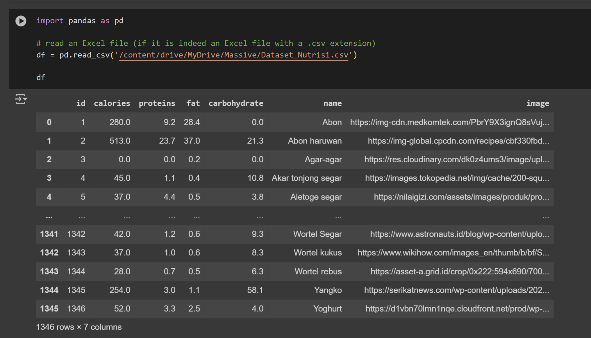 
-- Dataset Akhir:
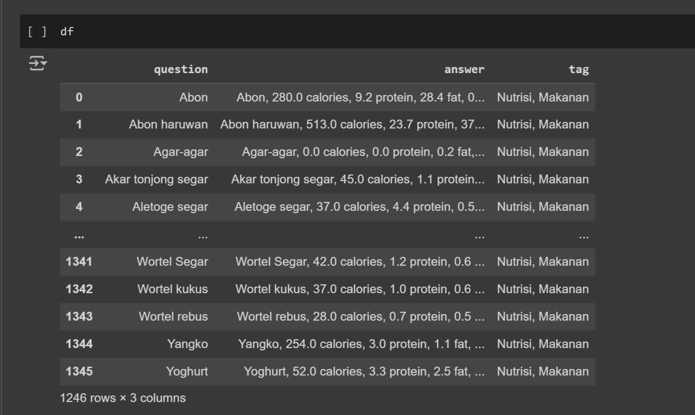

### 2. Algorithm
Algoritma yang kami gunakan sebenarnya tidak begitu spesifik dikarenakan kami menggunakan service dari IBM Cloud yang berperan penting dan krusial dalam pembuatan proyek ini. Maka bila boleh dikatakan kami menggunakan algoritma embedded ML didalam Watson discovery & Watsonx assistant, dimana mereka juga menggunakan/menerapkan NLP (anggap salah satu algoritma) untuk melakukan Entity Recognizer. Ada juga Intent Classification sebagai tujuan/produk/fitur utama.

- Framework <br />
Framework AI yang digunakan yaitu Watson discovery dan Watsonx Assistant yang merupakan layanan yang disediakan oleh IBM untuk membangun chatbot. Platform ini menawarkan solusi komprehensif untuk mengembangkan dan mengimplementasikan chatbot yang cerdas dan intuitif. 

- Pembangunan Model <br />
Dataset yang telah di preprocessing kemudian dilatih untuk mengklasifikasikan teks ke dalam kategori yang berbeda menggunakan Watson Discovery. Model klasifikasi dapat digunakan untuk mengidentifikasi topik percakapan, sentimen pengguna, atau maksud pengguna.

- Model Building, Training, and Evaluation <br />
Berikut Project Prototype Flow:
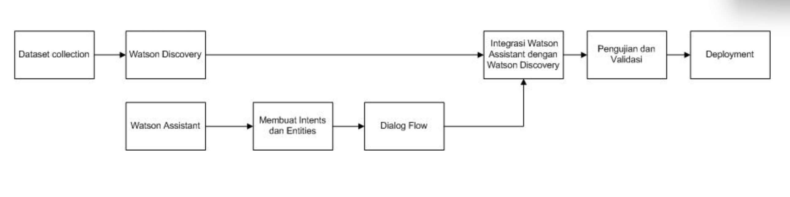
Penjelasan:<br />
// Dataset Collection: Langkah pertama adalah mengumpulkan dataset yang diperlukan untuk melatih model. <br />
// Watson Discovery: Data yang terkumpul kemudian dimasukkan ke dalam Watson Discovery untuk dianalisis. Watson Discovery digunakan untuk memahami dan mengekstraksi informasi dari data yang besar dan kompleks.<br />
// Watsonx Assistant: Watsonx Assistant digunakan untuk membangun antarmuka chatbot. <br />
// Membuat Intent dan Entities: membuat intents dan entities.. Intents adalah representasi dari tujuan pengguna, sementara entities adalah komponen dari data yang membantu memperjelas niat tersebut. <br />
// Dialog Flow: Setelah intents dan entities dibuat, langkah berikutnya adalah mengatur alur dialog (dialog flow). Ini menentukan bagaimana chatbot akan merespon terhadap berbagai input dari pengguna berdasarkan intents dan entities yang sudah dibuat. <br />
// Integrasi Watsonx Assistant dengan Watson Discovery: Kemudian, dilakukan integrasi antara Watsonx Assistant dan Watson Discovery. Integrasi ini memungkinkan chatbot untuk menggunakan kemampuan analisis data dari Watson Discovery dalam memberikan jawaban yang lebih akurat dan informatif kepada pengguna. <br />
// Pengujian dan Validasi: Setelah integrasi selesai, chatbot diuji dan divalidasi untuk memastikan bahwa semua fungsi bekerja dengan baik dan respon yang diberikan sesuai dengan harapan. <br />
// Deployment: Langkah terakhir adalah deployment ke web FitGuide. <br />

## Prototype
Flow prototype chatbot pada website FitGuide:
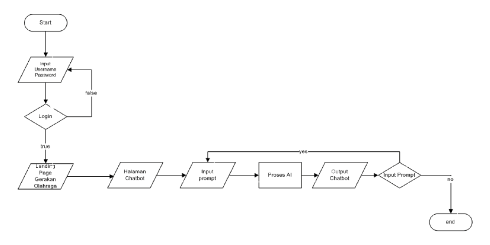
Penjelasan:<br />
// Input Username Password: Pengguna harus memasukkan nama pengguna dan kata sandi mereka ke web FitGuide <br />
// Login: Proses autentikasi. Jika autentikasi gagal (false), pengguna tidak dapat melanjutkan. Jika autentikasi berhasil (true), pengguna diarahkan ke halaman berikutnya.<br />
// Landing Page Gerakan Olahraga: Setelah berhasil login, pengguna diarahkan ke halaman utama yang mungkin berisi berbagai informasi atau fitur web FitGuide.<br />
// Halaman Chatbot: Pengguna kemudian mengakses halaman chatbot.<br />
// Input prompt: Pengguna memasukkan prompt atau pertanyaan yang ingin diajukan kepada chatbot mengenai rekomendasi makanan.<br />
// Proses AI: Prompt yang dimasukkan oleh pengguna diproses menggunakan teknologi AI untuk menghasilkan jawaban atau respon yang sesuai.<br />
// Output Chatbot: Hasil dari proses AI ditampilkan kepada pengguna sebagai output dari chatbot.<br />
// Input Prompt: Flowchart memeriksa apakah pengguna ingin memasukkan prompt tambahan (yes) atau tidak (no). Jika "yes", alur kembali ke langkah "Input prompt". Jika "no", alur menuju langkah akhir.<br />
// End: Menandakan akhir dari proses.<br />

## Deployment & Integration

Menggunakan layanan Watsonx Assistant yang diintegrasikan dengan Watson Discovery untuk memberikan chatbot dengan kemampuan untuk memahami dan mengekstrak informasi dari teks. Berikut langkah-langkah integrasi dan pembuatan interface chatbot:<br />
- Membuat project assistant. Masukkan nama project lalu klik Create assistant.
- Pilih menu integrations untuk mengintegrasikan watson discovery dengan Watsonx assistant.
- Tampilan menu integrations.
- Cari bagian extensions, pilih search, dan klik open.
- Pilih watson discovery.
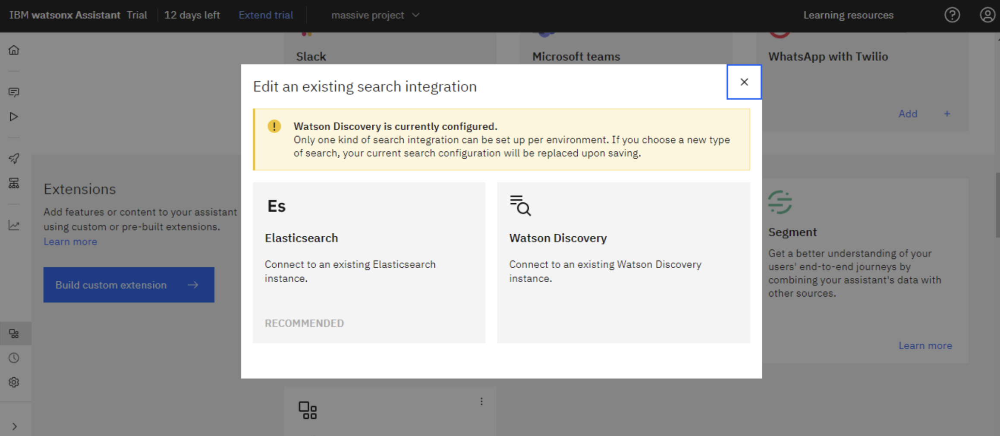
- Memilih instansi Discovery untuk dihubungkan dengan Watsonx assistant.
- Memilih proyek watson discovery yang ingin diintegrasikan. Setelah itu klik next.
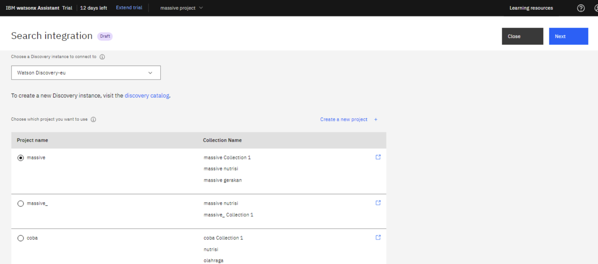
- Pada halaman Search integration masukkan Title yang diinginkan, memilih Body yang nantinya menjadi jawaban dari input yang user berikan.
- Melihat preview contoh tampilan chatbot yang telah terintegrasi.
- Scroll kebawah pada halaman Search integration untuk mengatur Message jika model dapat menemukan jawaban dari user, pada proyek ini kami kosongkan sehingga pada contoh tertulis Search results sebelum jawaban model.
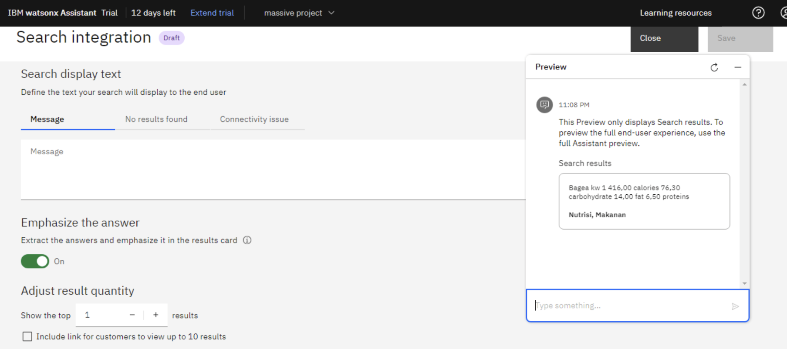
- Uji hasil integrasi dengan menanyakan pertanyaan berhubungan dengan makanan bernutrisi.
- Setelah Watsonx assistant dapat mendapat jawaban dari watson discovery, lalu klik save.
- Masuk ke menu action untuk memanggil model ke Watsonx assistant.
- Klik New action untuk membuat action.
- Pilih start from scratch.
- Masukkan nama action.
- Tampilan action baru.
- Pada conversation steps isi nama step menjadi sent to wd untuk mengarahkan inputan user ke model.
- Pilih Search for the answer agar terhubung dengan integrasi sebelumnya.
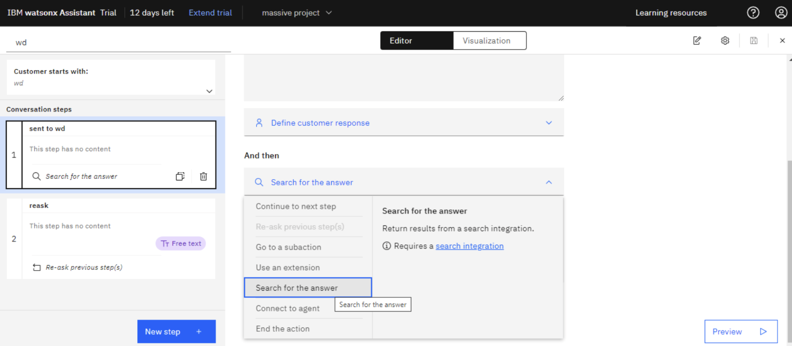
- Klik New step untuk membuat step baru.
- Pada step kedua ini beri nama reask untuk membuat proses tanya jawab di chatbot berulang atau tidak berakhir setelah mengeluarkan satu jawaban. Jadi intinya menambah kan action & step yang cukup sesuai kebutuhan sampai akhirnya menjadi seperti ini.
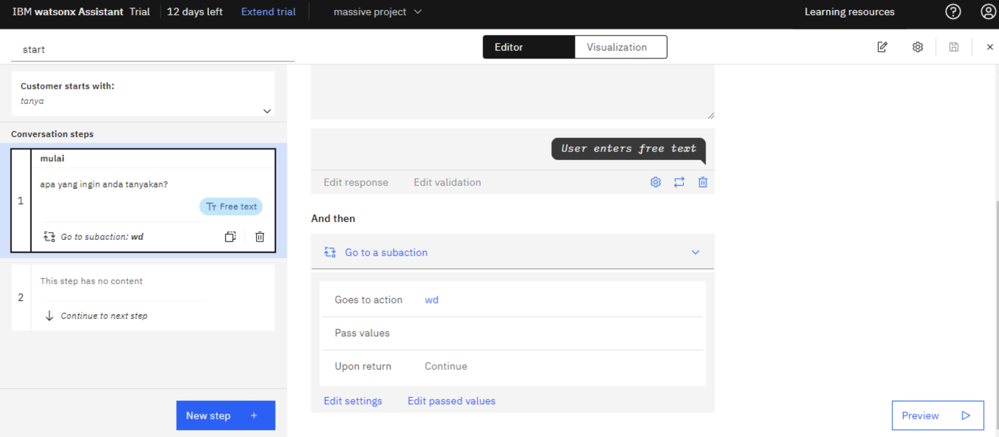
- Tampilan preview chatbot dan coba dengan memasukkan input mulai maka chatbot akan menjawab sesuai yang telah diatur pada action start. Coba dengan memasukkan pertanyaan seputar rekomendasi makanan bernutrisi. Chatbot dapat menjawab pertanyaan sesuai dengan data di watson discovery.
- Setelah itu masuk ke menu preview untuk mengubah tampilan chatbot. Pilih Customize web chat.
- Pada menu style dapat merubah nama dan warna chatbot assistant dan pada menu Launcher dapat mengubah tulisan Greeting message.
- Menu home screen untuk mengubah teks awal saat chatbot di klik dan menampilkan rekomendasi kata kunci untuk memulai percakapan, akhirnya jadi seperti ini.
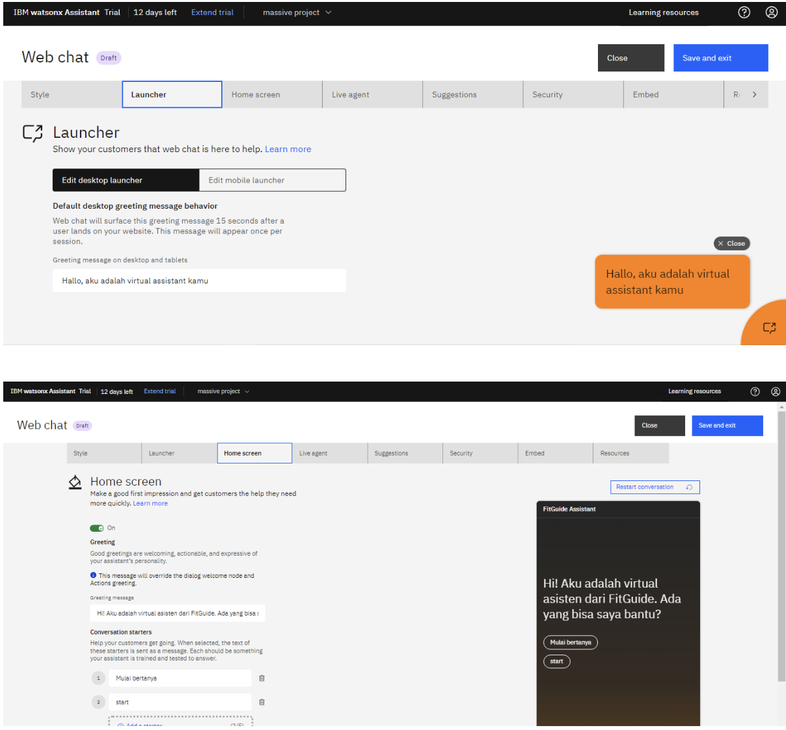
- Pada menu embed, terdapat kode untuk di deploy ke platform yang dikembangkan.
- Tinggal diberikan kepada pihak web.
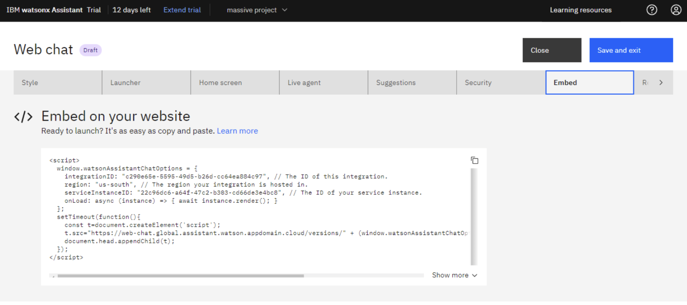

## Integrasi & Evaluasi
Integrasi model AI dengan website ini bertujuan untuk menyediakan panduan olahraga dan rekomendasi pola hidup sehat bagi mahasiswa secara efektif. Dengan memanfaatkan layanan IBM Cloud seperti Watson Discovery dan Watsonx Assistant, solusi cerdas dan intuitif dapat tercipta. Proses ini dimulai dengan persiapan model AI, di mana Watson Discovery digunakan untuk mengumpulkan, menganalisis, dan mengekstrak wawasan dari data relevan, serta mengidentifikasi pola dan tren yang dapat membantu dalam memberikan rekomendasi kebugaran dan nutrisi. Selanjutnya, Watsonx Assistant dirancang untuk merancang dialog dan skenario interaksi, dilatih menggunakan data dialog yang relevan agar mampu menjawab pertanyaan pengguna terkait kebugaran dan nutrisi, serta diintegrasikan dengan wawasan dari Watson Discovery. Integrasi model dengan website dilakukan melalui API yang disediakan oleh IBM Cloud, memastikan bahwa model dapat menangani permintaan pengguna dan memberikan respons yang tepat. UI website juga diatur agar dapat menampilkan rekomendasi dan tanggapan dari AI secara real-time, sehingga memberikan pengalaman interaktif dan informatif bagi pengguna.<br />
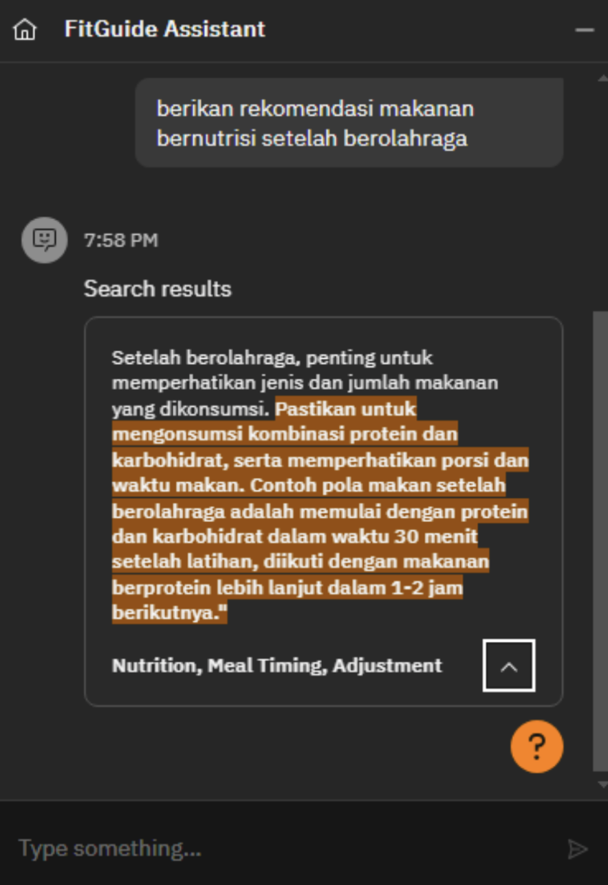


LINK TEST DEPOLYMENT : [test](https://web-chat.global.assistant.watson.appdomain.cloud/preview.html?backgroundImageURL=https%3A%2F%2Fus-south.assistant.watson.cloud.ibm.com%2Fpublic%2Fimages%2Fupx-22c96dc6-a64f-47c2-b303-cd66de3e4bc8%3A%3Ae7987399-4106-47d1-915c-2bc31a2ee395&integrationID=c290e65e-5595-49d5-b26d-cc64ea884c97&region=us-south&serviceInstanceID=22c96dc6-a64f-47c2-b303-cd66de3e4bc8)

## Conclusion
Proyek FitGuide telah berhasil mencapai sejumlah tujuan penting dengan memanfaatkan teknologi AI dan platform web. FitGuide memberikan solusi inovatif untuk membantu mahasiswa mencapai kebugaran dan kesehatan optimal melalui panduan olahraga yang aman dan disesuaikan serta rekomendasi pola hidup sehat. Proyek ini tidak hanya meningkatkan aksesibilitas olahraga bagi mahasiswa melalui integrasi dengan website yang terintegrasi AI, tetapi juga membantu mengurangi biaya ke gym dan meningkatkan efisiensi waktu mahasiswa. FitGuide menjamin kualitas layanan melalui proses training dan uji coba yang ketat, serta berhasil menjangkau mahasiswa dengan berbagai kebutuhan kesehatan, termasuk mereka yang mengalami obesitas atau memiliki jadwal padat. Secara teknologi, FitGuide berkontribusi pada bidang sains dan teknologi dengan mengembangkan model kecerdasan buatan yang akurat dan memanfaatkan visualisasi data untuk pemahaman yang lebih baik terhadap tren dan pola. Melalui penggunaan IBM Cloud services seperti Watson Discovery dan Watsonx Assistant, proyek ini menunjukkan integrasi teknologi maju dalam mendukung solusi kesehatan dan kebugaran yang lebih baik. Untuk masa depan, FitGuide merencanakan pengembangan dengan fokus pada meningkatkan akurasi AI, memperluas dataset, meningkatkan UX, validasi data nutrisi, serta integrasi layanan tambahan untuk meningkatkan fungsi dan fleksibilitas platform.

## Other Documentation
[DOC DRIVE 1 UNUSED](https://drive.google.com/drive/folders/1izdJnOLYQ2qRy8WwH30xPmU__Uva5KaA?usp=sharing)<br/>
[DOC DRIVE 2 USED & UNUSED](https://drive.google.com/drive/folders/1n0zkms86B8fAbbyFvx_26NwZ3U8YJ_OK?usp=sharing)

---
<h2 align="center"> INFINITE LEARNING </h2>
